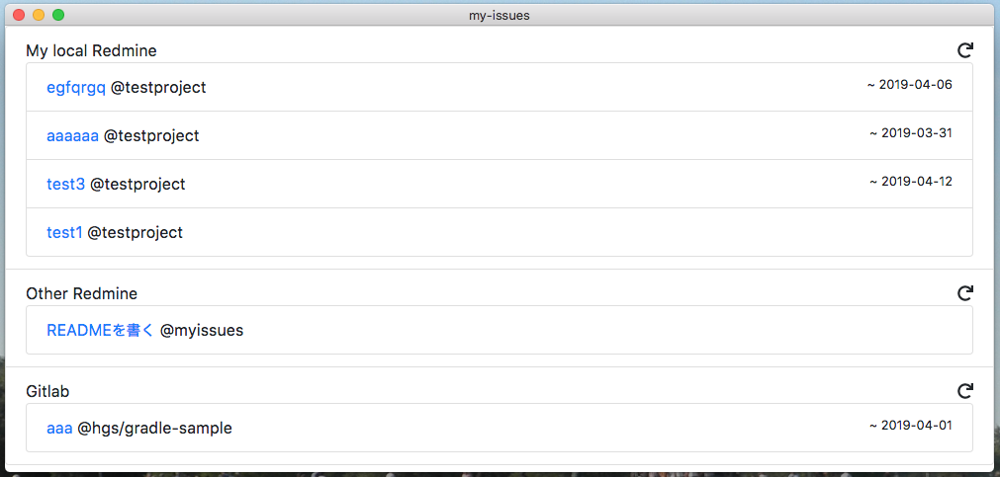

= My Issues

Show assigned tasks of tools(Redmine, GitLab)




== How to use

1. Create configuration file on `$HOME/.myisses.json` or `$MYISSUES_CONFIG_FILE`
2. Start application


=== Support tools

* Redmine
* GitLab

== Configuration file

[source,json]
----
[
    {
        "type": "redmine",
        "name": "Local Redmine",
        "url": "http://localhost:3001",
        "token": "xxxxxxxxxxxx",
        "params": {
            "limit": 5
        }
    },
    {
        "type": "gitlab",
        "name": "Gitlab",
        "url": "https://gitlab.com",
        "token": "xxxxxxxxxxx"
    }
]
----


|===
| Key | Description

| type
| Type of tools: redmin, gitlab

| name
| Display name

| url
a| Tools url
 
| token
| REST API token

|===


== Build Setup

``` bash
# install dependencies
npm install

# serve with hot reload at localhost:9080
npm run dev

# build electron application for production
npm run build

# run unit & end-to-end tests
npm test


# lint all JS/Vue component files in `src/`
npm run lint

```

This project was generated with link:https://github.com/SimulatedGREG/electron-vue[electron-vue]
link:https://github.com/SimulatedGREG/electron-vue/tree/8fae4763e9d225d3691b627e83b9e09b56f6c935[@[8fae476]] using 
link:https://github.com/vuejs/vue-cli[vue-cli]. 
Documentation about the original structure can be found link:https://simulatedgreg.gitbooks.io/electron-vue/content/index.html[here].
